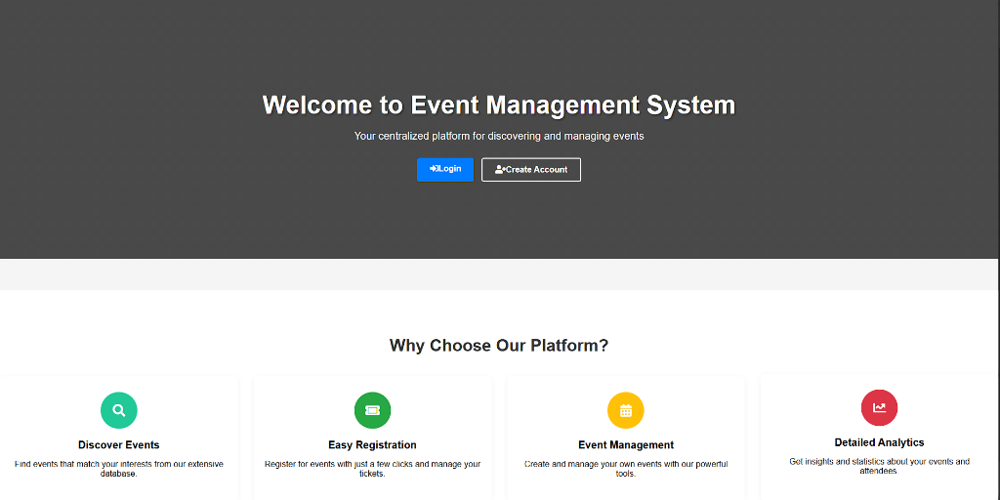
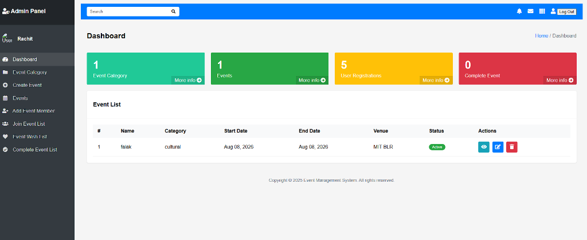
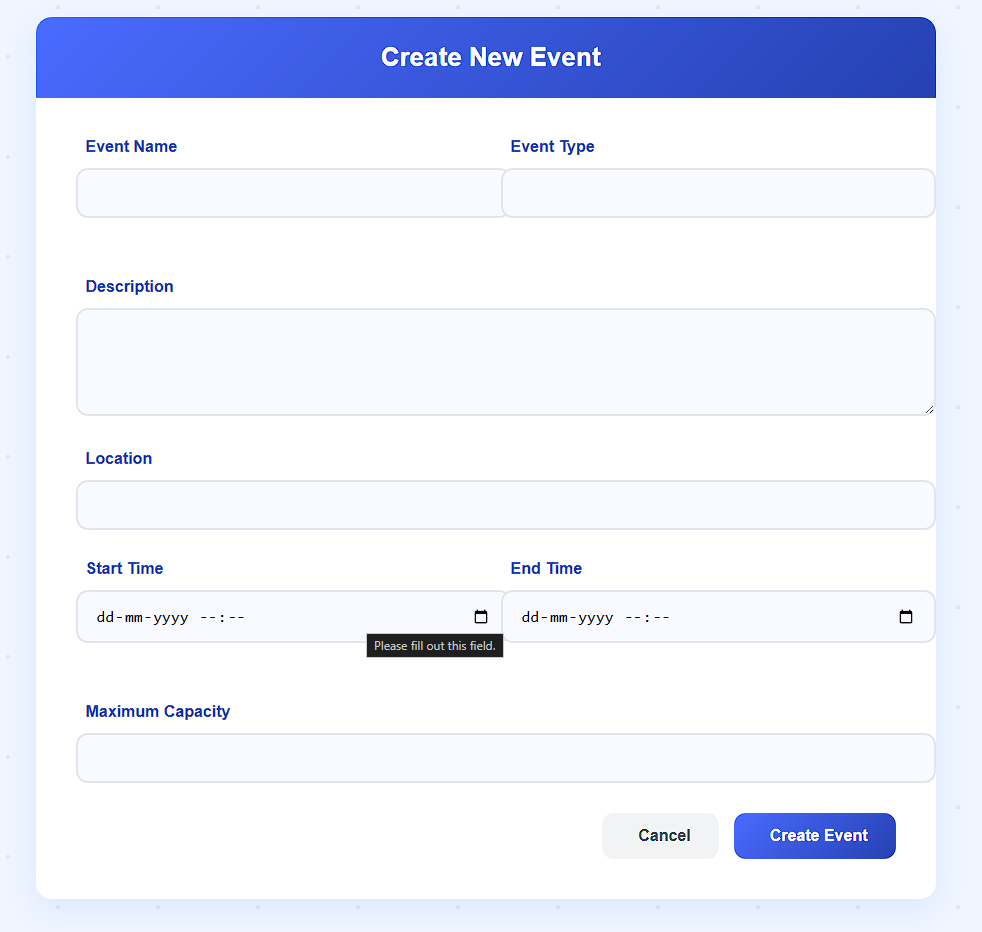
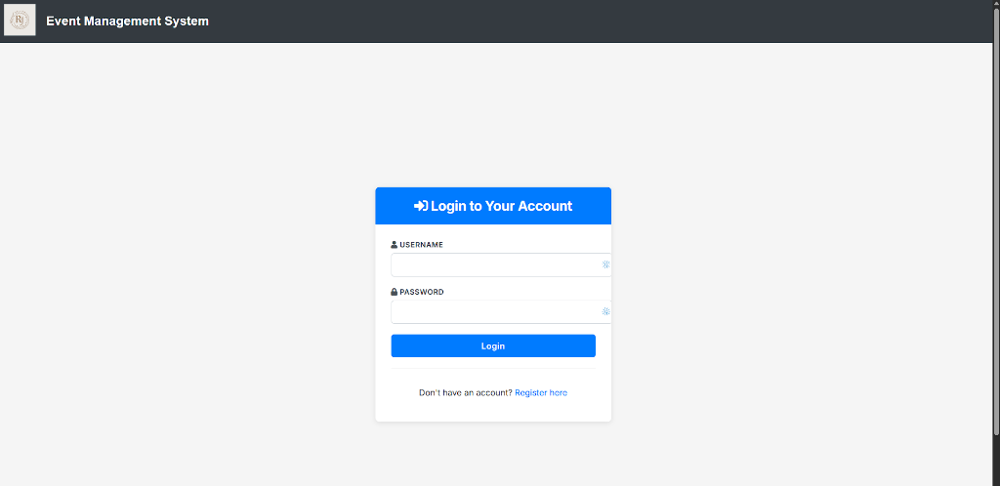

# 🎉 Event Management System

A web-based **Event Management System** built using the **Django Framework** that simplifies event organization, registration, and attendee management. The application provides separate dashboards for administrators and users, making event management efficient and user-friendly.

---

## 📖 Overview

The Event Management System (EMS) is designed to provide a centralized platform where organizers can create and manage events while users can browse, register, and manage their event tickets. The project follows Django's **Model-View-Template (MVT)** architecture for a clean, scalable, and maintainable codebase.

---

## ✨ Features

### 👨‍💼 Admin
- Dashboard with event statistics
- Create, update, and delete events
- View and manage registered users (Recent User Registrations)
- Configure ticket types and pricing
- Track registrations

### 👤 User
- Browse available events
- Register for events (with automated capacity limits)
- View registered events
- Manage tickets
- Personal dashboard

---

## 🛠 Tech Stack

| Technology | Description |
|------------|-------------|
| **Backend** | Django (Python) |
| **Frontend** | HTML5, CSS3, JavaScript, Bootstrap |
| **Database** | MySQL |
| **Authentication** | Django Authentication System |

---

## 🏗 System Architecture

The application follows Django's **MVT (Model-View-Template)** architecture.

- **Models** – Define database tables and relationships.
- **Views** – Handle application logic and user requests.
- **Templates** – Render dynamic web pages using HTML and Bootstrap.

---

## 🔄 Project Pipeline (Request Lifecycle)

1. **User Request**: A user interacts with the UI (e.g., clicks "Register", logs in, or clicks "Create Event").
2. **URL Routing**: The `urls.py` files intercept the request and map it to the appropriate view function.
3. **Security & Logic**: The view checks authentication (`@login_required`), authorization (e.g., `is_staff`), and business constraints (e.g., verifying an event hasn't reached `max_capacity`).
4. **Database Operations**: The view queries or updates the MySQL database securely via Django Models and Form validation.
5. **Template Rendering**: The view prepares the context data and renders the final HTML templates (using modern typography and Bootstrap) to return to the user's browser.

---

## 📂 Project Structure

```
event_management_system/
│── event_management_system/ (Project Settings)
│── events/ (Event App)
│── users/ (User App)
│── templates/
│── static/
│── media/
│── manage.py
│── requirements.txt
│── .env
│── .gitignore
└── README.md
```

---

## 🚀 Installation

### 1. Clone the repository

```bash
git clone https://github.com/CodedBankai/event_management_system.git
cd event_management_system
```

### 2. Create a virtual environment

```bash
python -m venv venv
```

Activate the virtual environment:

**Windows**

```bash
venv\Scripts\activate
```

**Linux / macOS**

```bash
source venv/bin/activate
```

### 3. Install dependencies

```bash
pip install -r requirements.txt
```

### 4. Configure Environment & Database

Create a `.env` file in the root directory (alongside `manage.py`) and add your database and secret credentials:

```ini
SECRET_KEY=your_django_secret_key
DEBUG=True
DB_NAME=eventmanagement
DB_USER=root
DB_PASSWORD=your_mysql_password
DB_HOST=localhost
DB_PORT=3306
```

Then run:

```bash
python manage.py makemigrations
python manage.py migrate
```

### 5. Create a Superuser

```bash
python manage.py createsuperuser
```

### 6. Start the Development Server

```bash
python manage.py runserver
```

Open your browser and visit:

```
http://127.0.0.1:8000/
```

---

## 📸 Screenshots

| Home Page | Admin Dashboard |
|------|-----------|
|  |  |

| Create Event | Login / Register |
|--------------|--------------|
|  |  |

---

## 🔐 Security Features

- Django Authentication
- Role-Based Access Control
- Password Hashing
- CSRF Protection
- Input Validation
- Secure Authorization
- **Environment Variables for Secrets Management** (using `python-dotenv`)

---

## 🌟 Future Enhancements

- 💳 Payment Gateway Integration
- 📧 Email Notifications
- 🎟 QR Code Tickets
- 📊 Event Analytics
- ⭐ Reviews & Ratings
- 📅 Calendar Integration
- 🔔 Push Notifications
- 📱 Social Media Integration

---

## 🎯 Objectives

- Centralized event management platform
- Easy event registration process
- Efficient attendee tracking
- Secure ticket management
- Responsive user interface

---

## 🤝 Contributing

Contributions are welcome!

1. Fork the repository
2. Create a new branch

```bash
git checkout -b feature-name
```

3. Commit your changes

```bash
git commit -m "Add new feature"
```

4. Push to your branch

```bash
git push origin feature-name
```

5. Open a Pull Request

---

## 📄 License

This project is licensed under the MIT License.

---

## 👨‍💻 Author

**Rachit Sinha**

- GitHub: https://github.com/CodedBankai
- LinkedIn: https://www.linkedin.com/in/rachit-sinha-a859b6357
